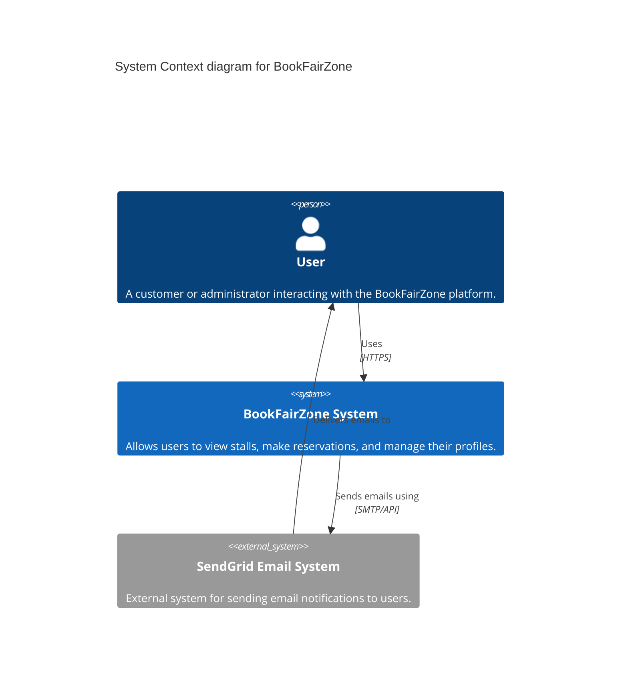
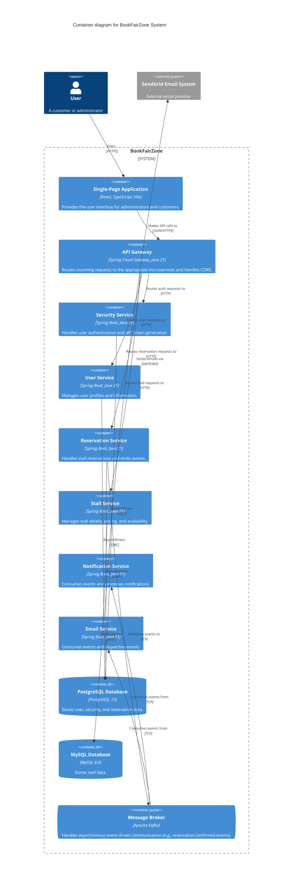

# BookFairZone 📚

BookFairZone is a comprehensive microservices-based platform designed to manage book fair stalls, user reservations, and notifications. Built with modern technologies, it offers a scalable and robust architecture for handling heavy traffic and complex business workflows.

## 🚀 Technologies Used

- **Frontend**: React, Vite, TypeScript, TailwindCSS, Shadcn UI
- **Backend**: Java 21, Spring Boot, Spring Cloud Gateway, Spring Security
- **Databases**: PostgreSQL, MySQL
- **Message Broker**: Apache Kafka, Zookeeper
- **Infrastructure**: Docker, Docker Compose

## 🏗️ Architecture (C4 Model)

The system architecture is designed using the C4 model for visualizing software architecture. Below are the Context and Container diagrams using Mermaid.

### 1. System Context Diagram

The System Context diagram shows the BookFairZone system in its environment, interacting with users and external systems.



### 2. Container Diagram

The Container diagram zooms into the BookFairZone System, showing the high-level technical building blocks (microservices, databases, and message brokers).



## 🛠️ Project Structure

- `api-gateway/`: Spring Cloud Gateway for routing requests.
- `security-service/`: Authentication and JWT token management.
- `user-service/`: User profile and identity management.
- `reservation-service/`: Core logic for booking and reservations.
- `stall-service/`: Manages stalls data.
- `notification-service/`: Listens to Kafka topics for system notifications.
- `email-service/`: Listens to Kafka topics and sends out emails via SendGrid.
- `bookfair-contracts/`: Shared DTOs and interfaces.
- `frontend/`: React SPA containing the UI.
- `docker-compose.yml`: Local full-stack infrastructure setup (Kafka, Zookeeper, Microservices, DBs).

## 🐳 Running Locally

1. **Prerequisites**: Ensure you have [Docker](https://www.docker.com/) and Docker Compose installed.
2. **Environment Variables**: Make sure to configure the root `.env` file with necessary secrets (e.g., Database credentials, JWT Secret, SendGrid API keys).
3. **Start the Infrastructure and Services**:
   ```bash
   docker-compose up --build -d
   ```
4. **Access the application**:
   - Frontend: `http://localhost:3000`
   - API Gateway: `http://localhost:8080`
   - Kafka UI: `http://localhost:8095`

## 🧪 Development

Each service can be developed and run independently. Ensure that the required infrastructure (PostgreSQL, MySQL, Kafka) is running via Docker before starting individual Spring Boot applications from your IDE.
